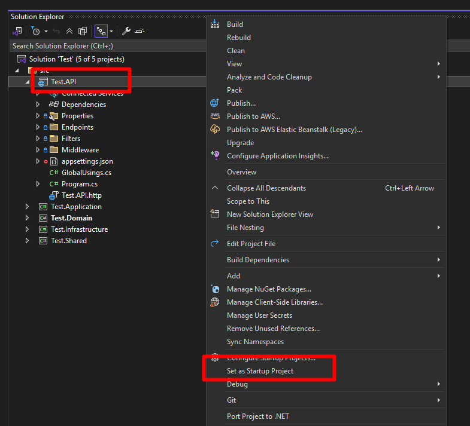

# 📦 Clean Architecture .NET Solution Generator

This is a **Bash/PowerShell script** that automatically sets up a Clean Architecture project structure for .NET applications, following Domain-Driven Design (DDD) and optional Test-Driven Development (TDD) standards.

> **Note:** The code base leverages [MLSolutions](https://github.com/Moclaw/MLSolutions).

_Currently, this script is tailored for **.NET 9**. Future support for additional .NET versions is planned._

---

## 🚀 Features
- Creates a full `src/` and `test/` directory structure
- Supports optional unit test project generation via `--with-test`
- Generates a `.gitignore` file suitable for .NET
- Installs NuGet packages for each project layer automatically
- Creates a Clean Architecture folder structure with `.gitkeep` placeholders
- Includes feature generation scripts for easy CQRS implementation
- Automatically sets the API project as the startup project
- Compatible with:
  - ✅ Bash for macOS/Linux
  - ✅ PowerShell for Windows

---

## 📂 Solution Structure

```
YourSolution/
├── .gitignore
├── YourSolution.sln
├── feature.ps1 (PowerShell feature generator)
├── feature.sh (Bash feature generator)
├── src/
│   ├── YourSolution.Domain/
│   ├── YourSolution.Application/
│   ├── YourSolution.Infrastructure/
│   ├── YourSolution.API/
│   └── YourSolution.Shared/
└── test/ (only if --with-test)
    ├── YourSolution.Domain.UnitTests/
    ├── YourSolution.Application.UnitTests/
    └── YourSolution.Infrastructure.UnitTests/
```

---

## 🛠️ How to Use

### 🐧 On macOS/Linux (using `setup.sh`)

1. Give execution permission:
   ```sh
   chmod +x setup.sh
   ```
2. Run the script:
   - To create only the main solution:
     ```sh
     ./setup.sh YourSolutionName
     ```
   - To create the solution with TDD unit test projects:
     ```sh
     ./setup.sh YourSolutionName --with-test
     ```

---

### 🪟 On Windows

#### Using PowerShell (`setup.ps1`)

- To create only the main solution:
  ```powershell
  .\setup.ps1 -SolutionName YourSolutionName
  ```
- To create the solution with unit test projects:
  ```powershell
  .\setup.ps1 -SolutionName YourSolutionName -WithTest
  ```

#### Using Command Prompt (`setup.bat`)

- To create only the main solution:
  ```cmd
  setup.bat YourSolutionName
  ```
- To create the solution with unit test projects:
  ```cmd
  setup.bat YourSolutionName /WithTest
  ```

---

## ▶️ Setting API as Startup Project

The script automatically configures the API project as the startup project in the solution. The configuration process includes:

1. For Visual Studio users:
- 
1. For VS Code or JetBrains Rider users:
   - The script generates appropriate configuration files to set the API project as default
   - For VS Code, a `.vscode/launch.json` file is created with the correct settings

2. For CLI users:
   - You can run the API directly using:
     ```sh
     dotnet run --project src/YourSolutionName.API
     ```

This ensures that regardless of your development environment, the API project will be properly configured as the application entry point.

---

## 🧩 Installed NuGet Packages

**Domain Layer:**
- Moclawr.Core
- Moclawr.Domain
- Moclawr.Shared

**Application Layer:**
- Moclawr.Core
- Moclawr.Services
- Moclawr.Services.Caching
- Moclawr.Shared

**Infrastructure Layer:**
- Moclawr.Core
- Moclawr.EfCore
- Moclawr.MongoDb
- Moclawr.Shared
- Moclawr.DotNetCore.Cap
- Moclawr.Services.External
- Serilog

**API Layer:**
- Moclawr.Core
- Moclawr.Shared
- Moclawr.MinimalAPI
- Moclawr.Host
- Serilog

**Shared Layer:**
- Moclawr.Shared

**Unit Test Projects** (if enabled with `--with-test`):
- xunit
- FluentAssertions
- Moq

---

## 📁 Clean Architecture Folders (per layer)

| Layer          | Folders Created                                                                           |
| -------------- | ----------------------------------------------------------------------------------------- |
| Domain         | Entities, ValueObjects, Repositories, Aggregates, DomainEvents, Specifications, Constants |
| Application    | DTOs, Interfaces, Services, Commands, Queries, Validators                                 |
| Infrastructure | Persistence/EfCore, Persistence/EfCore/Configurations, ExternalServices, Repositories     |
| API            | Endpoints, Filters, Middleware                                                            |
| Shared         | SharedKernel                                                                              |
| Application    | DTOs, Interfaces, Services, Commands, Queries, Validators                                 |
| Infrastructure | Persistence, ExternalServices, Repositories                                               |
| API            | Controllers, Filters, Middleware                                                          |


## 📋 Example

```sh
./setup.sh ECommerce --with-test
```

or on Windows:

```powershell
.\setup.ps1 -SolutionName ECommerce -WithTest
```

or using Command Prompt:

```cmd
setup.bat ECommerce /WithTest
```

Creates a complete Clean Architecture solution named `ECommerce` with unit testing projects ready for TDD.

## 🔄 Custom Templates

The script uses template files located in the `templates` directory. You can customize these templates to change the default implementations:

- Application.Service.Register.cs
- Infrastructure.Service.Register.cs
- GlobalUsings.cs
- Program.cs
- ApplicationDbContext.cs
- ConfigurationFilter.cs
- CommandDefaultRepository.cs
- QueryDefaultRepository.cs
- ServiceKeys.cs
- appsettings.Development.json
- feature.ps1 (PowerShell feature generator)
- feature.sh (Bash feature generator)

The script will automatically adapt these templates to your solution name.

## 🧩 Feature Generation

The setup scripts also install feature generation tools that help you quickly scaffold new features using the CQRS pattern. The feature generators are available in both PowerShell and Bash versions for cross-platform compatibility.

### 🐧 On macOS/Linux (using `feature.sh`)

```sh
./feature.sh <FeatureName> <Type> <OperationName>
```

Example:
```sh
./feature.sh User Command Create
```

### 🪟 On Windows (using `feature.ps1`)

```powershell
.\feature.ps1 -FeatureName <FeatureName> -Type <Type> -OperationName <OperationName>
```

Example:
```powershell
.\feature.ps1 -FeatureName User -Type Command -OperationName Create
```

These commands will generate the following structure:

```
src/YourSolution.Application/Features/User/Commands/Create/
├── Create.Request.cs
├── Create.Response.cs
└── Create.Handler.cs
```

And corresponding endpoint:

```
src/YourSolution.API/Endpoints/User/Commands/
└── Create.Endpoint.cs
```

Valid types are:
- `Command`: For write operations (POST, PUT, DELETE)
- `Query`: For single-item read operations (GET by ID)
- `Queries`: For collection read operations (GET lists)